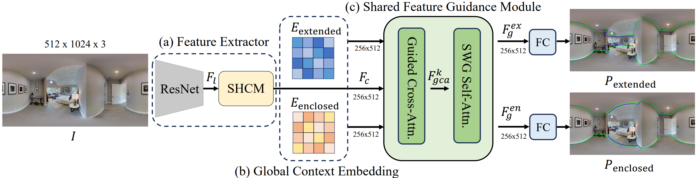

# Bi-Layout
This is PyTorch implementation of our paper "[No More Ambiguity in 360° Room Layout via Bi-Layout Estimation](https://arxiv.org/abs/2404.09993)"(CVPR 2024).  
 [[Project Page](https://liagm.github.io/Bi_Layout/)]




Inherent ambiguity in layout annotations poses significant challenges to developing accurate 360° room layout estimation models. To address this issue, we propose a novel Bi-Layout model capable of predicting two distinct layout types. One stops at ambiguous regions, while the other extends to encompass all visible areas. Our model employs two global context embeddings, where each embedding is designed to capture specific contextual information for each layout type. With our novel feature guidance module, the image feature retrieves relevant context from these embeddings, generating layout-aware features for precise bi-layout predictions.

A unique property of our Bi-Layout model is its ability to inherently detect ambiguous regions by comparing the two predictions. To circumvent the need for manual correction of ambiguous annotations during testing, we also introduce a new metric for disambiguating ground truth layouts. Our method demonstrates superior performance on benchmark datasets, notably outperforming leading approaches. Specifically, on the MatterportLayout dataset, it improves 3DIoU from 81.70% to 82.57% across the full test set and notably from 54.80% to 59.97% in subsets with significant ambiguity.


# Installation
Install our dependencies:
```shell
conda create -n bi_layout python=3.8 -y
conda activate bi_layout
pip install -r requirements.txt
conda install pytorch==1.12.0 torchvision==0.13.0 cudatoolkit=11.3 -c pytorch -y
```


# Preparing Model Weights
You can download our model weights at [here](https://huggingface.co/LIAGM/Bi_Layout_Model/tree/main).

Make sure the model weight files are stored as follows:
```
checkpoints/
|-- Bi_Layout_Net
    |-- mp3d
        |-- mp3d_best_model.pkl
    |-- zind_all
        |-- zind_all_best_model.pkl
    |-- zind_simple
        |-- zind_simple_best_model.pkl
```


# Preparing Dataset
### MatterportLayout
You can download our processed MatterportLayout dataset at [here](https://huggingface.co/datasets/LIAGM/Bi_Layout_Dataset/blob/main/mp3d.zip).

Make sure the dataset files are stored as follows:
```
src/dataset/mp3d/
|-- image
    |-- 17DRP5sb8fy_08115b08da534f1aafff2fa81fc73512.png
|-- label
    |-- 17DRP5sb8fy_08115b08da534f1aafff2fa81fc73512.json
|-- split
    |-- test.txt
    |-- train.txt
    |-- val.txt
|-- all_mix_labels_in_uv_v2
    |-- 17DRP5sb8fy_08115b08da534f1aafff2fa81fc73512.txt

```

### ZInd
Office ZInd dataset is at [here](https://github.com/zillow/zind).

Make sure the dataset files are stored as follows:
```
src/dataset/zind/
|-- 0000
    |-- panos
        |-- floor_01_partial_room_01_pano_14.jpg
    |-- zind_data.json
|-- room_shape_simplicity_labels.json
|-- zind_partition.json
```


# Evaluation
You can evaluate by executing the following command:

If you want to save the visual results, please add "--save_eval" to the command.

- MatterportLayout dataset
    ```shell
    python main.py --cfg src/config/mp3d.yaml --mode test
    ```
- ZInd All dataset
    ```shell
    python main.py --cfg src/config/zind_all.yaml --mode test
    ```
- ZInd Simple dataset
    ```shell
    python main.py --cfg src/config/zind_simple.yaml --mode test
    ```


# Training
Execute the following commands to train  (e.g., MatterportLayout dataset):
```shell
python main.py --cfg src/config/mp3d.yaml --mode train
```
- You can copy and modify the configuration in `YAML` file for other training.
- You can change the configuration of pin memory at line 26 in "dataset/build.py" to see the training speed change.


# Acknowledgements
The code style is modified based on [Swin-Transformer](https://github.com/microsoft/Swin-Transformer).

Some components refer to the following projects:

- [HorizonNet](https://github.com/sunset1995/HorizonNet#1-pre-processing-align-camera-rotation-pose)
- [LED2-Net](https://github.com/fuenwang/LED2-Net)
- [PanoPlane360](https://github.com/sunset1995/PanoPlane360)
- [DuLa-Net](https://github.com/SunDaDenny/DuLa-Net)
- [indoor-layout-evaluation](https://github.com/bertjiazheng/indoor-layout-evaluation)
- [LGT-Net](https://github.com/zhigangjiang/LGT-Net)

---

# Citation
If you use this code for your research, please cite
```
@inproceedings{tsai2024no,
        title={No more ambiguity in 360◦ room layout via bi-layout estimation},
        author={Tsai, Yu-Ju and Jhang, Jin-Cheng and Zheng, Jingjing and Wang, Wei and Chen, Albert 
        and Sun, Min and Kuo, Cheng-Hao and Yang, Ming-Hsuan},
        booktitle={Proceedings of the IEEE/CVF Conference on Computer Vision and Pattern Recognition},
        year={2024}
      }
```
